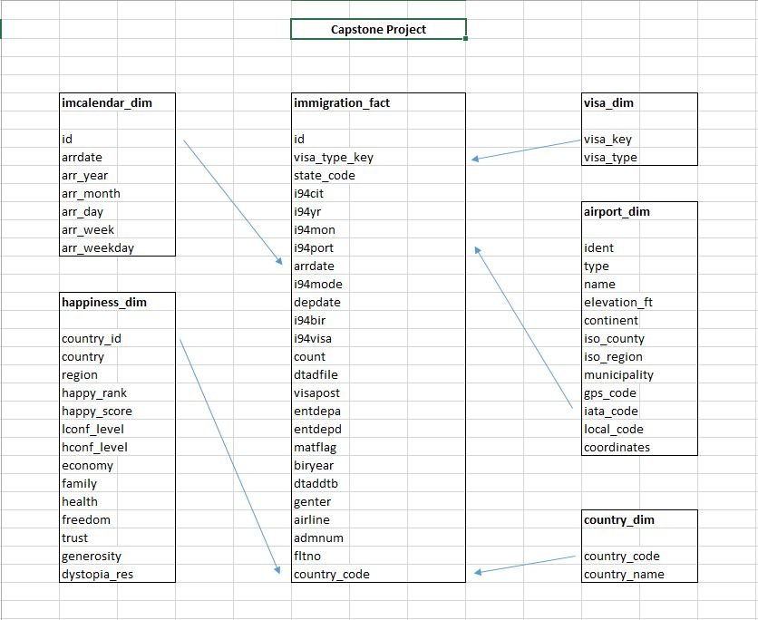

# Data Engineering Capstone Project

## Project Summary
The purpose of the data engineering capstone project is to give you a chance to combine what you've learned throughout the program. The objective of this project was to create an ETL pipeline for I94 immigration, airport data, state and world happiness rating data.
Goal of this project is create analitics database to find immigration patterns to the US. Through the database we could try to find answears to questions such as, do people from countries with unhappy or happy rating immigrate to the US in large numbers, or which airport is more frequent for immigrants.

## Data Code and Prerequisites
Prerequisites: AWS EMR cluster, Apache Spark, Python 3
All the data for this project was loaded into S3 before start the project, only is the i94_state.csv file which was loaded into Amazon EMR filesystem. 

In addition to the data files, the project workspace includes:
* **iam.cfg** - contains configuration that allows the ETL pipeline to access AWS EMR cluster. 
* **Capstone_project_Happy.ipynb** - jupyter notebook that was used for building the ETL pipeline.

### The project follows the following steps:
Data Engineering Capstone Project Happy
Project Summary
The goal of this project was to create ETL pipleine for immigration, airport data, state and world happiness rating data. We could try to find answears to questions such as, do people from countries with unhappy or happy rating immigrate to the US in large numbers, or which airport is more frequent for immigrants.

The project follows the following steps:
* Step 1: Scope the Project and Gather Data
* Step 2: Explore and Assess the Data
* Step 3: Define the Data Model
* Step 4: Run ETL to Model the Data
* Step 5: Complete Project Write Up

## Step 1: Scope the Project and Gather Data
### Project Scope
To create the database through the following steps:
* Use Spark to load the data into dataframes.
* Data analysis and data cleaning of I94 immigration dataset, airport dataset, state and world happiness rating data.
* Create immigration calendar dimension table from I94 immigration dataset and this table links to the fact table through the arrdate field.
* Create country dimension table from the I94 immigration dataset. 
* Create airport dimension table from the airport data and this table links to the fact table through the i94port field.
* Create happiness dimension table from the happiness data and this table links to the fact table through the country_code field.
* Create visa dimension table from the I94 immigration data and this table links to the fact table through the visa_type_key field.
* Create fact table from the clean I94 immigration dataset and the visa_type dimension.

## Step 2: Explore and Assess the Data

Explore, cleaning and data analysis is in to the jupyter notebook - Capstone_project_Happy.ipynb.

## Step 3: Define the Data Model
### 3.1 Data Model

In this project we have 5 dimensions table and 1 fact table. 
The airport dimension table comes from airport_codes_csv and link to fact table through the i94port field.
The country dimension table is made up of data from the immigration datasets and link to fact table through the country_code field.
The happiness dimension table comes from the happiness dataset and links to the immigration fact table through the state code field. 
The visa type dimension table comes from the immigration datasets and links to the immigaration through the visa_type_key field. 
The immigration fact table is the heart of the data model. This table's data comes from the immigration data sets and contains keys that links to the dimension tables.

### 3.2 Mapping Out Data Pipelines
The pipeline steps are as follows:
* Load the datasets and analysis data
* Clean all data missing data and column 
* Create visa_type, country, immigration calendar, happiness and airport dimension table
* Create immigration fact table
* Checking the number of data

## Step 4: Run Pipelines to Model the Data 
### 4.1 Create the data model
Procedure, data dictionary and data checks in to the jupyter notebook - Capstone_project_Happy.ipynb.

### 4.2 Data Quality Checks
Data count checks on fact and dimension table to be ensure that ETL procedure works fine.

### 4.3 Data dictionary 
Data dictionary for new data model

## Step 5: Complete Project Write Up
* I use Apache Spark beacause it's ability to handle multiple file formats with large amounts of data and it's fast for big data and large dataset. Immigration data will be updated mounthly and other data yearly. 
* Scenario:
If the data was increased by 100x - Spark can easyly increase number of nodes in our AWS cluster.
If the pipelines were run on a daily basis by 7am - We can use Apache Airflow and schedule data pipline.
If the database needed to be accessed by 100+ people - We can use Amazon Redshift.